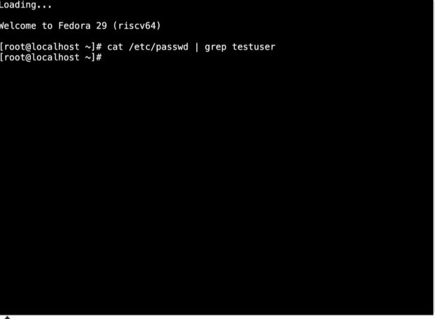
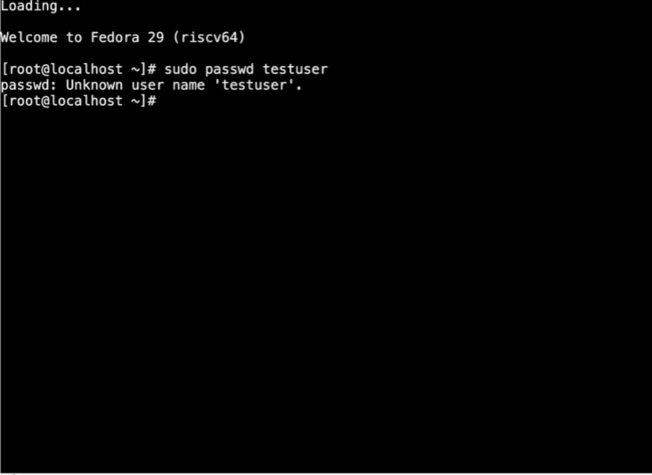
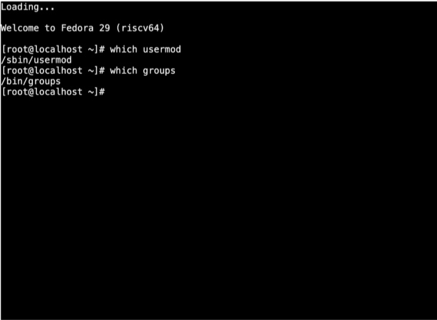

# Linux-User-and-Group-Management-Lab

## Overview 
This project demonstrates basic Linux system administration tasks, focusing on user and groupmanagement in a fedora virtual machine 
envoirement.

## Skills Learned
- Creating user accounts using 'useradd'
- -Setting and managing passwords using 'password'
- Createing groups using 'groupadd'
- Adding users to groups using 'usermod'
- -Verifyinguser and group information using 'id' and 'groups'

## Envoirement
-Fedora Linux (Virtual Machine)

## Commands Used
- Useradd
- passwd
- groupadd
- usermod
- id
- groups

## Project Tasks
1. Verified if user exists
2. 2.Created a new user
3. 3. Set password for user
4. Created a new group
5. Added user to group
6. Verified user nd group membeship

## Screenshots
### User Creation

### Group Creation
![Group Creation] (Linux User and Group Manae 2.jpg)
### Password Setup

### Group Assignment 

            7. 
